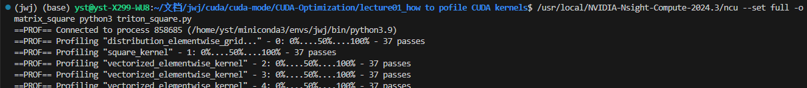
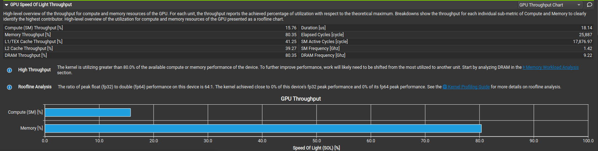
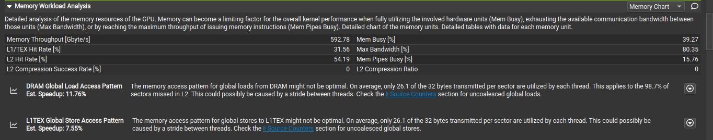
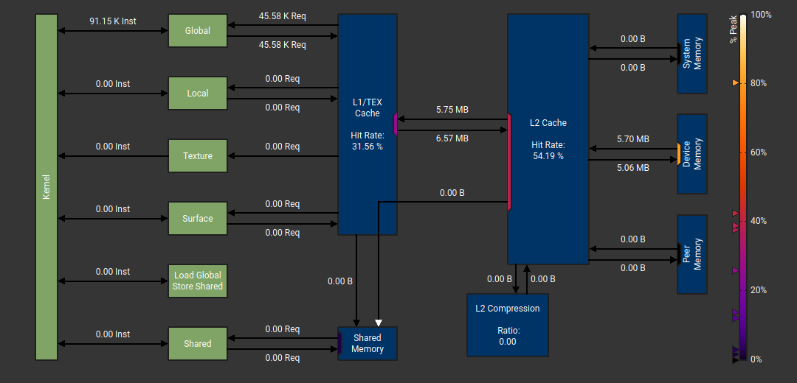
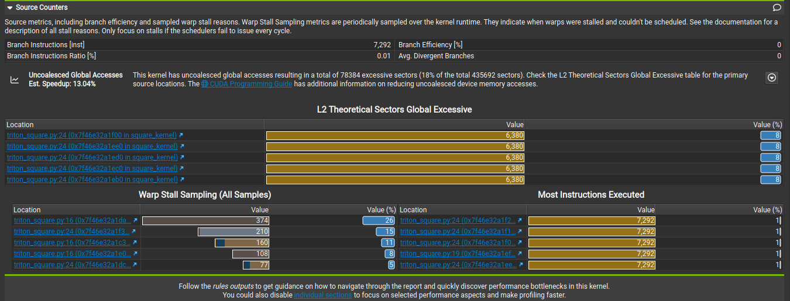

生成xx.ncu-rep文件
命令：/usr/local/NVIDIA-Nsight-Compute-2024.3/ncu --set full -o matrix_square python3 triton_square.py
结果：  当出现如下界面并生成matrix_square.nuc-rep说明成功
       

Nsight Compute分析：
打开 maxtrix_square.ncu-rep
命令：/usr/local/NVIDIA-Nsight-Compute-2024.3/ncu-u1 matrix_square python3 

Duration:函数执行时间  Compute Throughput：计算吞吐量  Memory Throughput：内存吞吐量

1.GPU资源的利用情况

内存吞吐量(80.35%)大于计算吞吐量(15.76%)，说明是访存密集型算子
L1/TEX和L2缓存吞吐量相对较低，可能存在优化空间
DRAM吞吐量与总体吞吐量相同，说明内存操作直接与DRAM交互

2.内存使用情况

Memory Throughput 内存吞吐量(592.78GB/s)   Max BandWidth 带宽利用率(80.35%)

可以看到没有把数据加载到shared memory

3.计数器 执行次数、访问次数 (Source Counters部分)

    分支指令数量：7292
    分支指令比率：0.01%
    分支效率和平均发散分支都是0，表明分支预测效果确实好

    未合并的全局访问：导致78384个多余sector(占总体的18%)

    L2未有效利用：位置出在triton_square.py文件的第24行

    warp停滞的位置：triton_square.py文件的第16、24行
    16行代码：row = tl.load(input_ptrs, mask=col_offsets < n_cols, other=-float('inf'))
    24行代码：tl.store(output_ptrs, square_output, mask=col_offsets < n_cols)
    分析： 当前代码在存储数据时使用了掩码 mask=col_offsets < n_cols，这可能导致未合并的内存访问，如果可能，将数据填充到 BLOCK_SIZE，这样就不需要使用掩码。或者尝试不同的BLOCK_SIZE获取更好的性能等等

    Most Instructions Executed：执行指令最多的位置(前5)

4.warp在各状态下消耗的周期 (Warp State Statistics 部分)